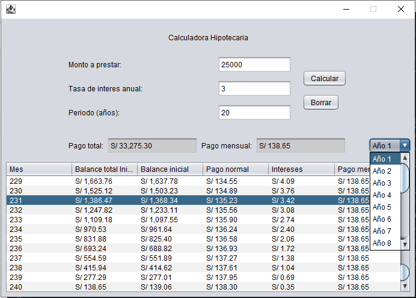

# 🏦 Calculadora Hipotecaria

Aplicación de escritorio desarrollada en Java con Swing que permite calcular las cuotas mensuales de un préstamo hipotecario, visualizar el desglose mes a mes y navegar por año.



## ¿Qué hace?

- Calcula la **cuota mensual** y el **pago total** de un préstamo hipotecario usando la fórmula de amortización francesa (cuota fija).
- Genera una **tabla de amortización completa** con el desglose por mes:
  - Balance total restante
  - Balance de capital restante
  - Pago a capital
  - Intereses del mes
  - Cuota mensual
- Permite **navegar por año** directamente desde un menú desplegable.
- Muestra los montos en formato de moneda peruana (S/).

## Requisitos

- Java 17 o superior
- Apache Maven 3.6 o superior

## Cómo ejecutarlo

Clona el repositorio y ejecuta los siguientes comandos desde la raíz del proyecto:

```bash
mvn clean package
mvn exec:java
```

O si prefieres correr el `.jar` generado directamente:

```bash
java -jar target/CalculadoraHipotecaria-1.0-SNAPSHOT-jar-with-dependencies.jar
```

## Datos de entrada

| Campo | Rango permitido |
|---|---|
| Monto a prestar | S/ 1,000 – S/ 1,000,000 |
| Tasa de interés anual | 1% – 100% |
| Período | 1 – 30 años |

## Tecnologías

- Java 17
- Swing (interfaz gráfica)
- Apache Maven (gestión del proyecto)
- NetBeans (IDE utilizado para el desarrollo)

## Estructura del proyecto

```
src/
└── main/java/mibanka/calculadorahipotecaria/
    ├── Cuota.java                 # Lógica de cálculo hipotecario
    └── PrestamoHipotecario.java   # Interfaz gráfica principal
```
